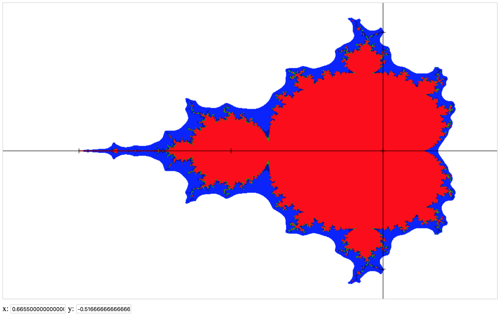

# Mandelbrot
Draw Mandelbrot set with a simple web page.



Inspired by the great math youtuber Michaël Launay : https://youtu.be/dQeIUrLKM9s

## How to launch
Simply open the mandelbrot.html file in your favorite browser.

You can zoom in by drawing a zoom rectangle with the mouse (down and up).

## Parameters
If you want to play with the rendering (increase or decrease precision, etc.), here are the set of parameters within the html file:

Display parameters:
```javascript
var xmin = -2.5; // smallest x axis value
var xmax = 0.75; // largest x axis value
var ymin = -1.25; // smallest y axis value
var ymax = 1.25; // smallest x axis value
```

Specific parameters of the Mandelbrot series computation:

Taking into account the series:
``
z(n) = z(n-1)^2 + c
``

```javascript
var threshold = 100; // limit value of z where we consider the series as divergent
var layers = 3; // number of figures to draw
var startLayer = 1; // starting layer
```

The number of iterations per layer is n: 
```
for the 1st layer: n_max = 10 * startLayer
for the last layer: n_max = 10 * (layers - startLayer)
```

(Rem: c is equal to zero in that version as we want to display the 'classical' Mandelbrot set ;-))

## Dependencies
Google jQuery is used for mouse interactions.
